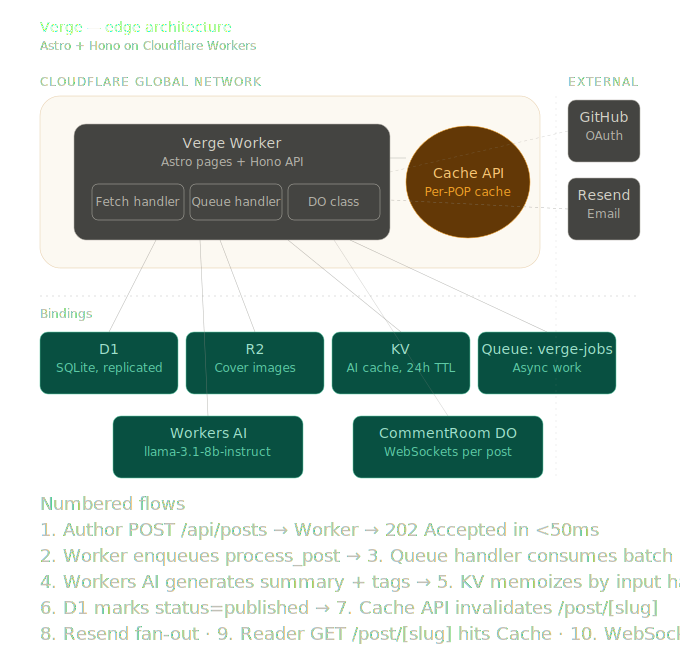
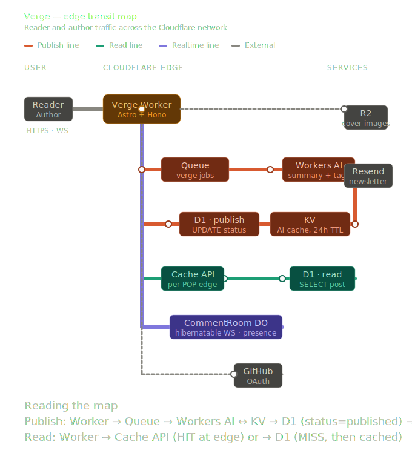
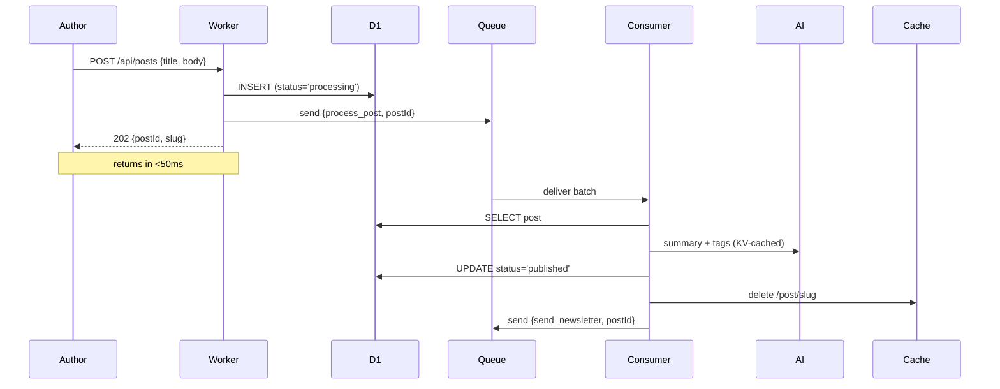

# Verge

An edge-native blogging engine running entirely on Cloudflare's network. No origin server, no central database, no cold starts.

**Live:** https://verge.yeeshu.workers.dev

---

## What this demonstrates

Verge is built to prove an architecture pattern: a real, stateful, multi-user app where every primitive — compute, persistence, queues, real-time state, AI, edge cache — runs inside Cloudflare's global network. Behind it sit decisions that show up in any serious edge-deployed system:

- **Sub-50ms write responses** even when the actual work (AI inference, image processing, fan-out email) takes seconds — through queue-decoupled processing.
- **Globally consistent real-time state** without a central coordinator — through Durable Objects with hibernatable WebSockets.
- **Edge-cached public reads with explicit invalidation** — fast for anonymous traffic, never stale after a publish.
- **Public-read, authenticated-write** as a first-class architectural concern, so caching never has to vary by user.

## What's built

A complete, end-to-end blogging platform. Specifically:

- **GitHub OAuth sign-in** via `arctic`, with sessions stored in D1 and cookies set with the right `Secure` / `SameSite=Lax` attributes for production.
- **Markdown editor with live preview** (`@uiw/react-md-editor` as an Astro island) — title, cover image upload, and a Publish button that returns a 202 Accepted in under 50ms.
- **Asynchronous publish pipeline.** Hitting Publish enqueues a `process_post` job; the queue consumer then, in parallel:
  - generates a 2-sentence summary via `@cf/meta/llama-3.1-8b-instruct` on the Workers AI binding
  - generates 5 topic tags from the same model
  - flips the post status from `processing` to `published`
  - invalidates the edge cache for the post URL
  - enqueues a `send_newsletter` job that fans out to all subscribers via Resend in batches of 50
- **AI summaries and tags surface on post cards** — readers see what a post is about before opening it.
- **Live discussion rooms over WebSockets** via a `CommentRoom` Durable Object, one per post. Anyone can connect to read; only logged-in users can post. Presence ("👁 N people reading") updates in real-time, and a typing indicator relays through the DO.
- **Cover images** uploaded directly through the Worker to R2; served via Cloudflare's image resizing on delivery (no pre-generated variants).
- **Newsletter subscriptions** — a public form on the homepage adds emails to D1; new posts trigger fan-out delivery automatically.
- **Edge-cached read path.** `/post/<slug>` is wrapped in the Cache API at every Cloudflare colo. First request renders Markdown and runs the D1 join; subsequent requests in that colo for the next 5 minutes return from cache. The queue consumer purges the cache after publishing.
- **Geo-personalized banner** on the homepage using `request.cf.country` and `request.cf.city` — zero-latency, runs in the same Worker invocation.
- **Structured logging** via `console.log(JSON.stringify(...))` for every meaningful event (post views, AI calls, comments, errors). Ready for Logpush ingestion when the project moves to Workers Paid.

## Architecture



A single Worker. The fetch handler serves Astro pages and a Hono API; the queue handler runs the async publish pipeline; a Durable Object class handles discussion rooms. One deploy, one set of bindings, one log stream.

### Request flow as a subway map

The same architecture viewed as three user journeys — each colored line is one path through the system, every station is a binding or external service.



## Why these Cloudflare primitives

Each piece was picked for a specific reason.

- **Workers** — V8 isolates, sub-ms cold start anywhere on the network. *No regional round-trips for any user.*
- **D1** — replicated SQLite, sub-ms reads from the closest colo. *Schema in `src/db/schema.ts`, migrations via drizzle-kit.*
- **R2** — zero-egress object storage. *Cover images served via Cloudflare's CDN at no per-byte cost.*
- **Durable Objects** — single-writer global actors with hibernatable WebSockets. *One instance per `idFromName(postId)` gives ordered, presence-aware comment rooms for free.*
- **Queues** — decouple write latency from total work. *Publish returns in <50ms; AI, newsletter, and cache invalidation run downstream.*
- **Workers AI** — `@cf/meta/llama-3.1-8b-instruct` via the `AI` binding. *No API key, no separate inference cost; results are SHA-cached in KV with 24h TTL.*
- **Cache API** — per-POP edge cache with explicit invalidation. *First read in a colo populates; queue consumer purges after publish.*

## The async write path



The editor polls `GET /api/posts/:id/status` every 1.5s while the consumer runs. The status flips from `processing` to `published` once the AI step completes. Newsletter delivery is a separate queue message so a Resend outage doesn't block publication.

## Local development

Prereqs: Node 22+, pnpm 10+, a Cloudflare account with `wrangler` logged in.

```sh
pnpm install
wrangler login

cp .dev.vars.example .dev.vars
pnpm db:local
pnpm dev
```

`.dev.vars` template:
GITHUB_CLIENT_ID=<dev OAuth app client id>
GITHUB_CLIENT_SECRET=<dev OAuth app client secret>
RESEND_API_KEY=<optional; newsletter sends are skipped without it>

The dev OAuth app's callback URL must be `http://localhost:4321/api/auth/github/callback`. Use a separate OAuth app for production (its callback points at the deployed worker URL); set its credentials with `wrangler secret put GITHUB_CLIENT_ID` / `GITHUB_CLIENT_SECRET`.

D1 migrations are generated with `pnpm drizzle-kit generate` and applied with `pnpm db:local` (Miniflare's local SQLite) or `pnpm db:remote` (real D1).

## Trade-offs

Each of these is a deliberate decision with a known cost.

- **Same-Worker consumer.** The queue handler lives in the same Worker as the fetch handler ([src/worker-shim.ts](src/worker-shim.ts)). One deploy, shared bindings, simpler ops. Cost: a slow AI call shares the isolate's CPU budget with fetch traffic. Splittable later by adding a second worker with `script_name` on the queue consumer.
- **SQLite-backed Durable Objects.** Selected via `new_sqlite_classes` in [wrangler.jsonc](wrangler.jsonc). Free-tier friendly and atomic. Cost: each DO instance is capped at ~5GB; fine for a per-post room, wrong for a single global firehose.
- **Direct uploads through the Worker.** `POST /api/upload` reads multipart and streams to R2. Simpler than presigning (Workers don't ship the AWS SDK) and lets every upload be auth-gated. Cost: every byte traverses the Worker. Fine for cover images, wrong for video.
- **Cache invalidation by URL string.** `caches.default.delete(url)` rather than surrogate keys. Works on the free plan. Cost: invalidation only hits the colo that received the delete; other colos serve cached content until `s-maxage` (5 min) expires. Acceptable for a blog; not for a live ticker.
- **arctic + GitHub OAuth, no auth provider.** No vendor lock-in, no extra latency. Cost: session storage, cookie security, and CSRF are all hand-rolled in `src/lib/auth.ts`.
- **Astro pages opt into SSR per-page.** Dynamic pages set `export const prerender = false`. Cost: easy to forget on new pages — a global `output: 'server'` would make it implicit.
